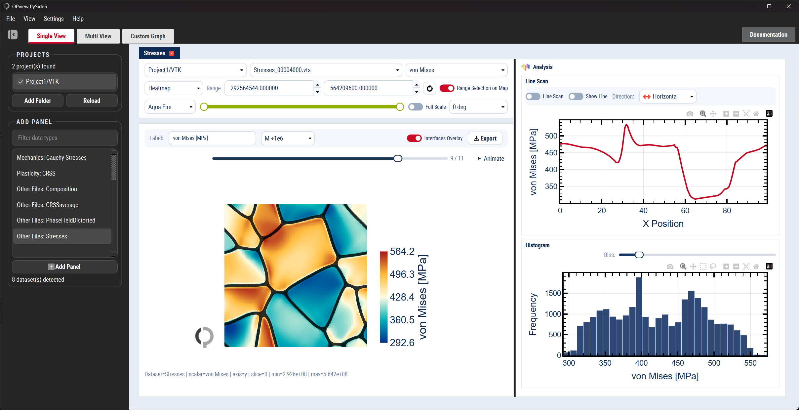
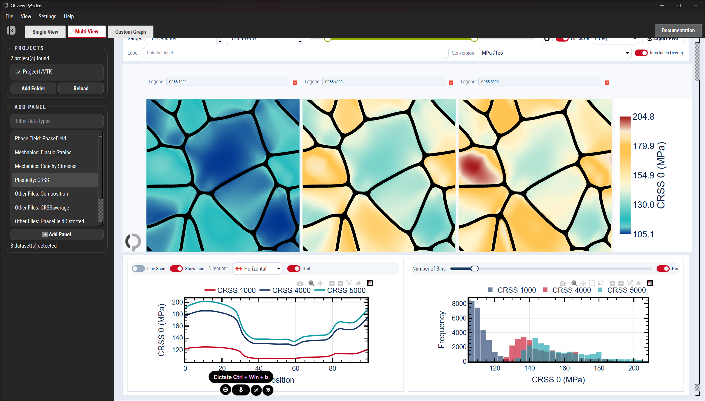
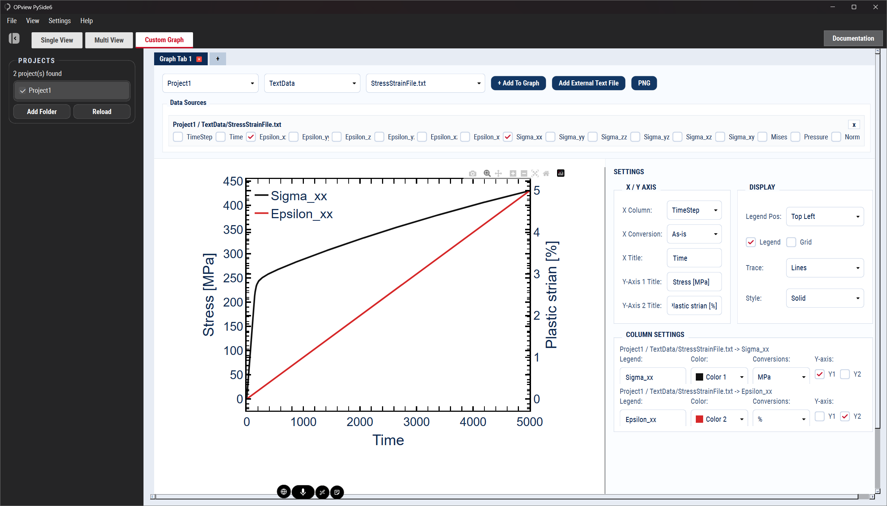

# OPView PySide6

A desktop post-processing application for inspecting OpenPhase simulation output through heatmaps, side-by-side comparison, and custom text-data graphs.

## Features

- Single View heatmaps with range controls, rotation, overlays, line scans, and histogram analysis.
- Multi View comparison across selected VTK files with shared orientation/range controls.
- Custom Graph panels for plotting `TextData` files with per-series colors, conversions, Y-axis routing, markers, and legend placement.
- Local in-app documentation from **Help > Documentation** or the header **Documentation** button.

## Screenshots

### Single View



### Multi View



### Custom Graph



## Setup

### Windows

Use the normal GPU/default launcher:

```bat
opview.bat
```

For virtual machines or systems without working 3D acceleration, use the no-GPU software rendering launcher:

```bat
OPview-No-GPU.bat
```

Both launchers check for Python, create the Windows virtual environment `venv-windows` if needed, install dependencies from `requirements.txt`, print setup/debug status messages, and start OPView. The no-GPU launcher also disables GPU-accelerated QtWebEngine rendering before the application starts.

### First-time setup (Linux / macOS / WSL)

```bash
chmod +x opview.sh
./opview.sh
```

### Running the application

On Windows, use the normal launcher:

```bat
opview.bat
```

For no-GPU software rendering, use:

```bat
OPview-No-GPU.bat
```

To scan a specific project folder, or a folder containing projects, pass the path from PowerShell or Command Prompt:

```powershell
.\opview.bat E:\RUB\OpenPhase\MyProject
.\OPview-No-GPU.bat E:\RUB\OpenPhase\MyProject
```

If the path contains spaces, wrap it in quotes:

```powershell
.\opview.bat "E:\RUB\OpenPhase\My Project"
.\OPview-No-GPU.bat "E:\RUB\OpenPhase\My Project"
```

Double-clicking a launcher scans the OPView folder itself. Use PowerShell or a shortcut argument when you want to pass a different project path.

On Linux / macOS / WSL, use:

```bash
./opview.sh
```

To scan a specific project folder, or a folder containing projects, pass the path:

```bash
./opview.sh /path/to/project-or-projects-folder
```

When done, deactivate the virtual environment:
```bash
deactivate
```

## Dependencies

- PySide6 (Qt for Python)
- VTK (Visualization Toolkit)
- NumPy
- Matplotlib
- Plotly
- PyVista
- SciPy

## Usage

1. Start the app with `opview.bat` on Windows, `OPview-No-GPU.bat` for software rendering, or `./opview.sh` on Linux / macOS / WSL.
2. Select or add a project in the sidebar.
3. Choose **Single View**, **Multi View**, or **Custom Graph** from the top tabs.
4. Use **Help > Documentation** for the complete local guide.

## Supported File Formats

- `.vti` - VTK Image Data
- `.vts` - VTK Structured Grid
- `.vtu` - VTK Unstructured Grid
- `.vtk` - Legacy VTK format

## Python Version

Requires Python 3.8 or higher (Python 3.14 is not compatible with VTK).
