# OpenPhase Post-Processing Suite

## Overview
The OpenPhase Post-Processing Suite is an interactive application for inspecting simulation outputs through four primary work modes:

- **Single View** for detailed inspection of one active dataset.
- **Multi View** for side-by-side comparison across multiple selected files.
- **Multi Property** for viewing several properties of one file side by side.
- **Custom Graph** for plotting trends from `TextData` files.

Use the **Documentation** button in the header or **Help > Documentation** from the menu to open this local guide at any time.

Supported visualization file types are: `.vtk`, `.vti`, `.vtp`, `.vts`, `.vtu`.
Supported text-data file types for **Custom Graph** are: `.txt`, `.dat`, `.csv`, `.opd`.

## Interface Overview
- **Sidebar** (left): project list, **Add Folder**, **Reload**, the **ADD PANEL** data-type selector, and the text-file browser with **Add External Text File**. Use the toggle button in the header to hide or show the sidebar.
- **Header**: top tabs (`Single View`, `Multi View`, `Multi Property`, `Custom Graph`) and the **Documentation** button.
- **Content area**: the active tab. Each added panel opens in its own closable tab.

### Project Discovery
A project folder is any folder that contains a `VTK/` and/or `TextData/` subfolder. At startup, OPView scans the folder passed on the command line (or the working folder) and lists every project found below it. Files are not watched automatically: click **Reload** in the sidebar after new simulation output is written.

VTK files that match a known OpenPhase output pattern are grouped into named data types (for example PhaseField). Any other VTK file is grouped by file name under **Other Files**, so unknown outputs still appear.

## Starting OPView
```bash
# Linux
./opview.sh [project_or_projects_folder]

# Windows
opview.bat [project_or_projects_folder]
```

| Option / variable | Effect |
|---|---|
| `project_folder` (optional argument) | Folder, or folder containing projects, to scan at startup. |
| `--version` | Prints the OPView version. |
| `OPVIEW_NO_GPU=1` | Forces software rendering. Use on VMs or machines without a usable GPU. On Windows use `OPview-No-GPU.bat`. |
| `OPVIEW_DEBUG=1` | Prints `[DEBUG]` tracing to the console. Off by default. |

## Getting Started
1. In the **PROJECTS** sidebar, select one or more project entries to load data into the app context.
2. If your project is not listed, click **Add Folder** and select the folder.
3. Choose the top tab based on your task:
   - **Single View** for one dataset.
   - **Multi View** for comparison.
   - **Multi Property** for several properties of one file.
   - **Custom Graph** for `TextData` analysis.
4. Use the relevant **ADD PANEL** selector to add the data type/panel you want to work with.
5. In **Custom Graph**, check the text-data projects you want available, then create a graph tab and choose project, folder, and file inside that tab.

## Common Viewer Controls
The main heatmap viewers (used in `Single View`, `Multi View`, and `Multi Property`) share these controls:

<table style="width:100%; border-collapse:collapse;">
  <thead>
    <tr>
      <th style="border:1px solid #cfd6e4; padding:8px; text-align:left;">Control</th>
      <th style="border:1px solid #cfd6e4; padding:8px; text-align:left;">Outcome</th>
    </tr>
  </thead>
  <tbody>
    <tr>
      <td style="border:1px solid #cfd6e4; padding:8px;"><strong>Select Folder</strong></td>
      <td style="border:1px solid #cfd6e4; padding:8px;">Chooses the active project folder for that panel. The available file list updates to that folder.</td>
    </tr>
    <tr>
      <td style="border:1px solid #cfd6e4; padding:8px;"><strong>Select File</strong></td>
      <td style="border:1px solid #cfd6e4; padding:8px;">Chooses the VTK file used for rendering. The heatmap updates to the selected file.</td>
    </tr>
    <tr>
      <td style="border:1px solid #cfd6e4; padding:8px;"><strong>Select Field</strong></td>
      <td style="border:1px solid #cfd6e4; padding:8px;">Chooses the scalar/component to display. The rendered field and colorbar update.</td>
    </tr>
    <tr>
      <td style="border:1px solid #cfd6e4; padding:8px;"><strong>Range:</strong> (<code>Min</code>, <code>Max</code>, and <strong>Reset</strong>)</td>
      <td style="border:1px solid #cfd6e4; padding:8px;">Sets explicit value bounds. The heatmap contrast and clipping update immediately.</td>
    </tr>
    <tr>
      <td style="border:1px solid #cfd6e4; padding:8px;"><strong>Range Selection on Map</strong></td>
      <td style="border:1px solid #cfd6e4; padding:8px;">Enables range picking from map clicks. Selected range limits are applied to the current view.</td>
    </tr>
    <tr>
      <td style="border:1px solid #cfd6e4; padding:8px;"><strong>palette</strong> dropdown</td>
      <td style="border:1px solid #cfd6e4; padding:8px;">Changes the color palette. The heatmap recolors with the selected palette. Choose <strong>Discrete Custom</strong> for hard color bands (see <em>Discrete Palette</em> below).</td>
    </tr>
    <tr>
      <td style="border:1px solid #cfd6e4; padding:8px;"><strong>Range slider</strong></td>
      <td style="border:1px solid #cfd6e4; padding:8px;">Interactively narrows or widens the visible value interval. Values outside the interval are clipped.</td>
    </tr>
    <tr>
      <td style="border:1px solid #cfd6e4; padding:8px;"><strong>Full Scale</strong></td>
      <td style="border:1px solid #cfd6e4; padding:8px;">Restores full-range scaling for the active field. The slider and rendering return to full data span.</td>
    </tr>
    <tr>
      <td style="border:1px solid #cfd6e4; padding:8px;"><strong>Rotation</strong></td>
      <td style="border:1px solid #cfd6e4; padding:8px;">Rotates 2D heatmaps by 0, 90, 180, or 270 degrees. Heatmap, overlay, click lookup, and line scans follow the selected orientation.</td>
    </tr>
    <tr>
      <td style="border:1px solid #cfd6e4; padding:8px;"><strong>Interfaces Overlay</strong> / <strong>Show Interfaces</strong></td>
      <td style="border:1px solid #cfd6e4; padding:8px;">Toggles interface overlay visibility. Interface boundaries appear/disappear on the map.</td>
    </tr>
    <tr>
      <td style="border:1px solid #cfd6e4; padding:8px;"><strong>Line Scan</strong></td>
      <td style="border:1px solid #cfd6e4; padding:8px;">Enables line-scan interaction mode. Click behavior switches to profile sampling.</td>
    </tr>
    <tr>
      <td style="border:1px solid #cfd6e4; padding:8px;"><strong>Show Line</strong></td>
      <td style="border:1px solid #cfd6e4; padding:8px;">Toggles the line marker visibility. The scan line appears/disappears in the view.</td>
    </tr>
    <tr>
      <td style="border:1px solid #cfd6e4; padding:8px;"><strong>Reset</strong> button</td>
      <td style="border:1px solid #cfd6e4; padding:8px;">Restores default range state for the active panel.</td>
    </tr>
    <tr>
      <td style="border:1px solid #cfd6e4; padding:8px;"><strong>PNG</strong> button</td>
      <td style="border:1px solid #cfd6e4; padding:8px;">Exports the currently shown heatmap as a PNG image.</td>
    </tr>
  </tbody>
</table>

### Colour Maps
Choose a colour map in the **palette** dropdown. The same selection exists in `Single View`, `Multi View`, and `Multi Property`.

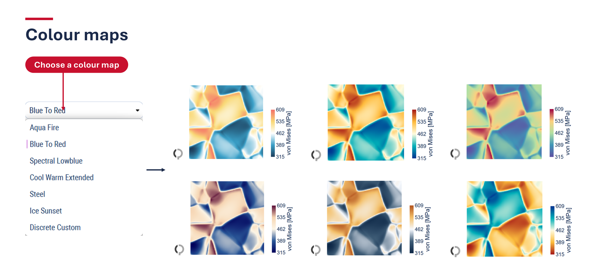

### Discrete Palette
Select **Discrete Custom** in the palette dropdown to show the field as hard color bands instead of a smooth gradient.

- **+** / **-** add or remove a band (2 to 10 bands). The current band count is shown between the buttons.
- The legend mode selector switches between **Bar** (continuous-style colorbar) and **Boxes** (numbered color boxes).
- The palette is available in `Single View`, `Multi View`, and `Multi Property`.

### Plot Types
| Plot type | Description | Available in |
|---|---|---|
| Heatmap | Continuous color map of the field. | All viewers |
| Contour Lines | Isolines only. | All viewers |
| Contour Filled | Discrete color bands between isolines. | All viewers |
| Contour Filled + Values | Color bands with labelled contour values. | All viewers |
| Heatmap + Contour | Heatmap with isolines on top. | All viewers |
| Threshold | Shows only values inside the selected range as solid color; selected phase fractions can be overlaid. | Single View |
| Difference (next - current) | Difference between the next file and the current file. | Single View |
| \|grad\| | Gradient magnitude of the field. | Single View |

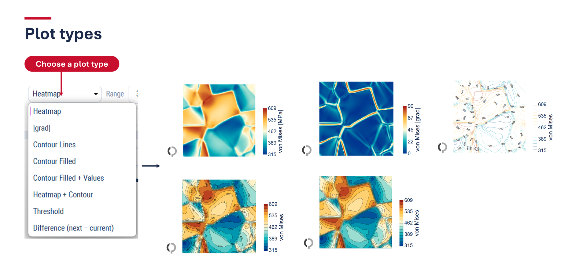

### Rotation
Click one of the four axis buttons to rotate the map. The heatmap, overlays, click lookup, and line scans follow the selected orientation.

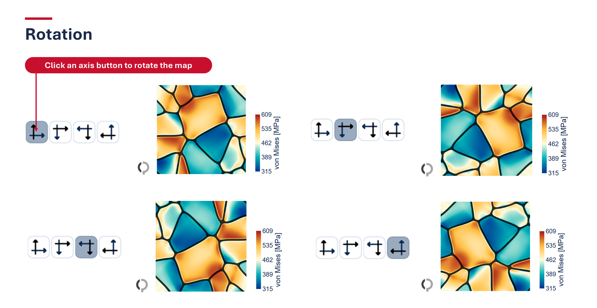

### Colorbar Ticks
Colorbar tick labels are formatted from the tick spacing: integers where possible, fixed decimals otherwise, and scientific notation for very large or small values.

## Single View
### Purpose
Use **Single View** for focused analysis of one dataset panel at a time.

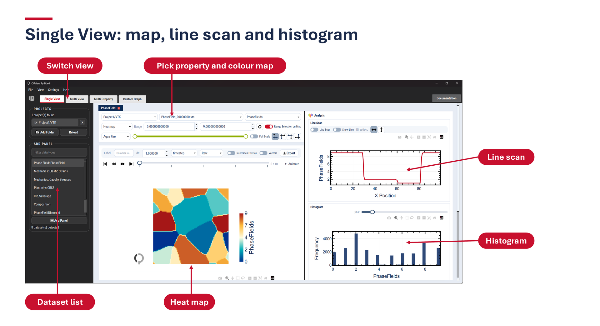

### Workflow
1. Open **Single View**.
2. In **ADD PANEL**, select a data type.
3. In the panel controls, choose **Select Folder**, **Select File**, and **Select Field**.
4. Adjust **Range:** values, **Range slider**, and **palette**.
5. Toggle **Full Scale**, **Interfaces Overlay**, **Line Scan**, and **Show Line** as needed.
6. Click **Reset** to return range settings to default.
7. Click **PNG** to export the current view.

### Additional Single View Features
- **Vector overlay**: when the selected array is a vector field, arrows are drawn over the heatmap. Arrow density is thinned automatically and the arrows follow the heatmap rotation.
- **Line Scan direction**: choose horizontal or vertical with the direction buttons next to **Line Scan**. The line keeps its relative position when the file extent changes between files.
- **Rotation** buttons (0, 90, 180, 270 degrees) rotate the heatmap, overlays, and line scans together.
- **Average over time**: the history plot below the heatmap shows PhaseField fractions or the whole-field average of the selected scalar for every timestep.
- **Settings** panel: collapse it with the toggle to give the heatmap more room; it shows as a rotated **Settings** rail when collapsed.
- **Unconfigured arrays**: scalar, vector norm, and vector component arrays that have no predefined entry are listed automatically in **Select Field**.
- **Plot types**: see the plot type table above.
- **Unit scale**: `Raw`, `% ×100`, `M ÷1e6`, and `G ÷1e9` rescale displayed values. The colorbar title shows the unit (for example `[MPa]`).

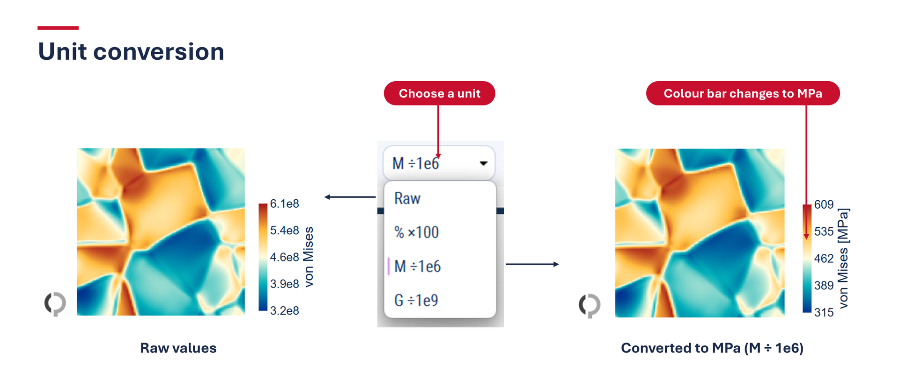
- **Slice**: for 3D data choose the slice axis (`X`, `Y`, `Z`) and move the slice index.
- **PNG export** produces a high-resolution image (2x scale, 300 DPI) matching the visible layout.

### Playback and Animation
When a dataset has several files (timesteps), the playback bar below the heatmap provides:
- **First**, **Previous**, **Next**, and **Last** frame buttons and a frame slider with tick marks. The frame label shows the current and total frame.
- **Animate**: opens the animation player, which loads all frames and plays them with play, pause, stop, a frame slider, and an FPS selector. **MP4** exports the animation as a video (requires `ffmpeg`).
- With the **Threshold** plot type, the animation applies the threshold range and any selected phase-fraction overlays to every frame.

### History Plots Below the Heatmap
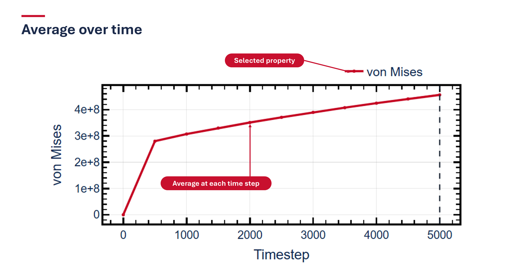

- **Phase fractions**: for PhaseField data, the volume fraction of each phase is plotted for every timestep. The **dt** field sets the time step used for the time axis. For other scalars the plot shows the whole-field average of the selected scalar.
- **Plot Over Time**: click **Add Point** (it shows **Add Point: ON** while active), then click the heatmap to pick one or more points. Each point is labelled P1, P2, ... and can be removed with its **X** button. **Calculate** plots one curve per point over all timesteps; **Use Same Points** makes this panel follow the points picked in other Single View panels; **Manual** lets you enter point coordinates; **Cancel** aborts picking; **Clear** removes the points; the **Show points** checkbox toggles the point markers on the heatmap.

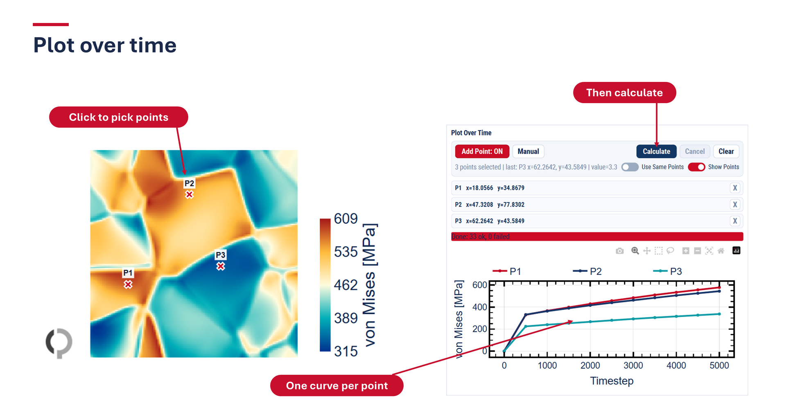

### Analysis Panel
The **Analysis** section next to the heatmap contains:
- **Line Scan**: click the heatmap to sample a profile along a horizontal or vertical line (**Direction:**).

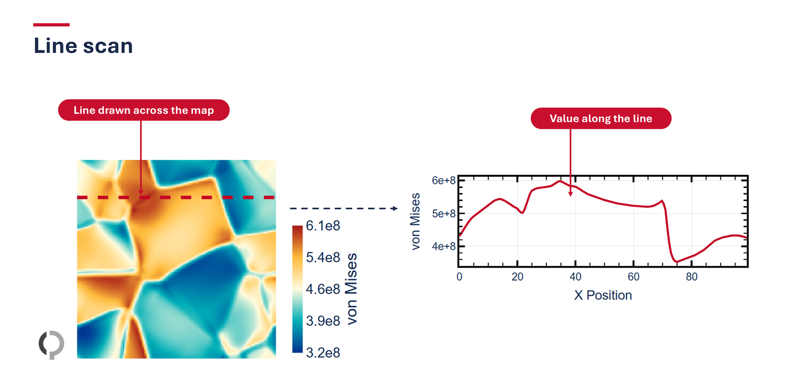

- **Histogram**: value distribution of the current field; **Bins:** sets the number of bins (fewer bins give a coarse shape, more bins show detail).

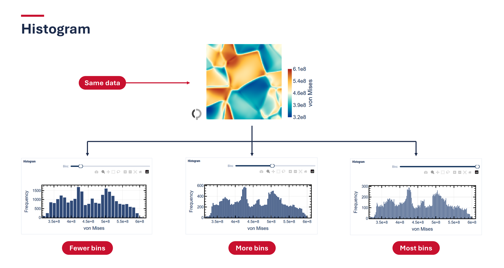

### Reloading Data
Click **Reload** in the sidebar to refresh after the simulation writes new output. Files are not watched automatically. Reload clears cached VTK data, adds newly created files of the active dataset to **Select File**, and removes files that were deleted from disk.

### Typical Use Cases
- Inspecting one dataset at one time/file state.
- Fine-tuning range and palette for feature visibility.
- Producing a single publication or report figure.

## Multi View
### Purpose
Use **Multi View** when you need direct visual comparison across multiple selected files.

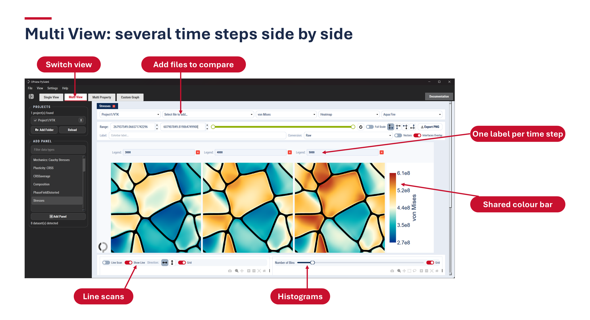

### Workflow
1. Open **Multi View**.
2. In **ADD PANEL**, select a data type to compare.
3. In the comparison card, choose **Select Folder** and one or more files in **Select File**.
4. Set **Select Field** for the comparison.
5. Adjust **Range:**, **Range slider**, **palette**, **Full Scale**, and **Show Interfaces**.
6. Use **Reset** when needed.
7. Use the comparison **PNG** export control to capture the current comparison state.

### Layout Behavior
- Files are added one at a time with **Select file to add**; each file gets its own heatmap and a shared colorbar.
- Use the unit **Conversion** (`Raw`, `% x100`, `MPa /1e6`, `GPa /1e9`) and the **Label:** field to adjust the displayed units and colorbar title.
- Vector arrays can be shown as arrows with the vector toggle.
- Line scan (with **Direction:**), histogram (with **Number of Bins**), and rotation controls apply to the comparison. Each file gets its own colour in the line scan and histogram.

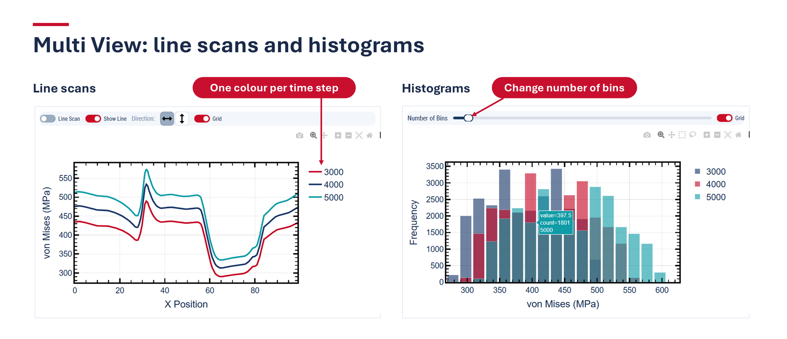
- Multiple heatmaps are displayed in the comparison area for selected files.
- Controls apply at the active comparison group level and update the corresponding comparison views.
- Comparison selection persists while navigating between top tabs during the same session.

### Typical Comparison Workflows
- Compare the same field across different files.
- Compare different projects under consistent palette/range settings.
- Export side-by-side comparison images for reports.

## Multi Property
### Purpose
Use **Multi Property** to view several properties of a single file side by side, with shared file selection and per-property range and palette controls.

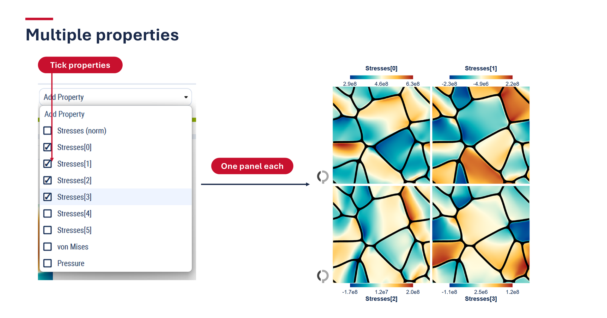

### Workflow
1. Open **Multi Property**.
2. In **ADD PANEL**, select a dataset. A new tab opens for it.
3. Choose **Project** and **Select file**.
4. Open the **Add Property** dropdown and tick the properties to show (one panel per property), or click **Add All** to add every property in the file.
5. For each property, adjust **Range**, **palette**, plot type, and unit scale (`Raw`, `% x100`, `MPa /1e6`, `GPa /1e9`).
6. Use the discrete palette **+** / **-** buttons and **Bar** / **Boxes** legend mode for banded data.
7. Use **Reset** (selected property) or **Reset All**; **Clear** removes all properties.
8. Click **Export PNG** to save the combined view.

### Analysis Tools
Line scans (with direction and value label), frequency histograms (with **Number of Bins**), and rotation buttons are available. Each property gets its own colour.

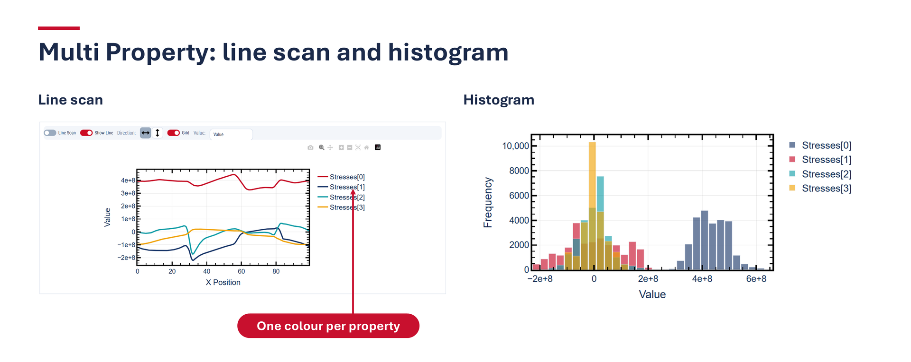

## Custom Graph
### Purpose
Use **Custom Graph** to analyze `TextData` numerically and build multi-series trend plots.

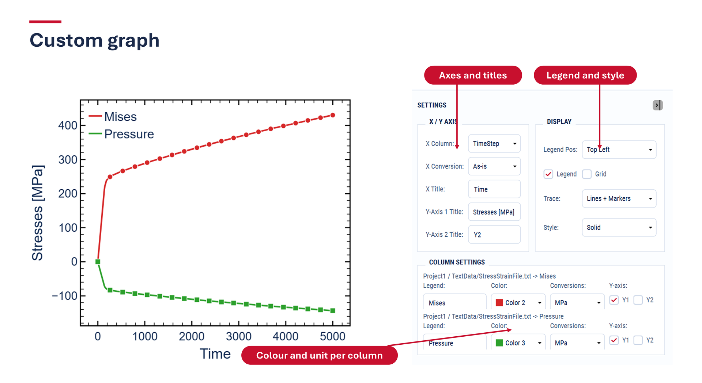

### Workflow
1. Open **Custom Graph**.
2. In **PROJECTS**, check the folders/projects that contain text data files (`.txt`, `.dat`, `.csv`, `.opd`).
3. Click the **+** tab to create an empty graph workspace.
4. In the graph tab, choose **Project**, **Folder**, and **Text File**, then click **Add To Graph**.
5. In **Data Sources:**, select columns to plot from the added file sections.
6. Configure graph settings in the right **Settings** area:
   - **X-Axis**: choose **Column** and edit **Title**.
   - **Display**: set **Legend Pos:**, toggle **Legend** / **Grid**, choose trace mode, and choose line style.
   - **Y-Axis**: edit Y1 and Y2 axis titles.
   - **Column Settings**: set legend labels, trace color, unit conversion, and assign each selected column to `Y1` or `Y2`.
7. Interact directly with the graph (zoom/pan/hover) and repeat adjustments until the plot is final.
8. Optionally open the **reveal animation** from the graph toolbar (see below).

### Controls and Outcomes
- **+** tab: creates an empty graph workspace.
- **Project / Folder / Text File** selectors: choose a checked project, one of its text-data folders, and a supported file.
- **Add External Text File**: loads a text-data file from any location, outside the checked projects.
- **PNG**: downloads the graph as an image. **Animate**: opens the reveal animation.
- **Add To Graph**: loads the selected text file into the current graph tab. Column selectors populate for added files.
- Column checklists: selects plotted series. Traces are added/removed from the graph.
- **X-Axis Column**: changes x-data source. All traces replot against the selected x-axis column.
- **Legend Pos:**: moves legend location. It supports plot corners and **Right Outside**.
- **Legend** / **Grid** toggles: show/hide legend and grid lines.
- **Trace:** renders lines, markers, or lines plus sampled markers.
- **Style:** changes the line dash pattern.
- **Column Settings**: routes each trace to an axis, updates label text, chooses line color, and applies conversion (`As-is`, `%`, `MPa`, `GPa`, or `Log10`).

### Reveal Animation
The animation dialog reveals every trace from left to right. Use play, pause, stop, the frame slider, and the FPS selector to preview it. Axis ranges stay fixed to the final data range. Click **Export MP4** to save the animation (requires `ffmpeg`). The graph itself is not modified.

### Typical Use Cases
- Plotting stress/strain or other tabular trends from `TextData`.
- Overlaying multiple files in one chart for trend comparison.
- Preparing graph outputs for analysis notes and publications.

## Exporting Results
- Heatmaps: click the **PNG** button in `Single View` or `Multi View` controls, or **Export PNG** in `Multi Property`.
- Animations: use **Export MP4** in the `Custom Graph` animation dialog.
- Graphs: use the graph toolbar export action in each `Custom Graph` panel.
- Exported files are saved through your browser/system download flow.

Recommended usage:
- Capture final figure states after setting range/palette/overlays.
- Export comparison snapshots from `Multi View` with consistent settings.
- Export graph images after final axis/unit/legend configuration.

## Troubleshooting
### Empty view
- Confirm a project is selected in **PROJECTS**.
- Confirm a panel is added through **ADD PANEL**.
- Confirm **Select File** and **Select Field** are set.

### Controls disabled
- Ensure the correct top tab is active (`Single View`, `Multi View`, `Multi Property`, or `Custom Graph`).
- In `Multi View`, select files first; field/range controls remain limited until files are selected.

### Graph not updating
- Ensure `Custom Graph` panel has selected files and columns.
- Check that the selected x-axis column exists in the loaded data.

### Missing or outdated files
- Click **Reload** in the sidebar to rescan projects. Reload in a viewer adds new files of the active dataset and removes deleted ones.
- Folders without `VTK/` or `TextData/` subfolders are not recognised as projects.

### Animation export fails
- MP4 export requires `ffmpeg` to be installed and on the `PATH`.

### Slow interaction
- Reduce the number of simultaneously selected comparison files.
- Reduce active graph traces in `Custom Graph` panels.
- Apply updates in smaller steps (range, then field, then overlays).

### Rendering problems on a VM or without GPU
Start OPView with `OPVIEW_NO_GPU=1` (Linux) or `OPview-No-GPU.bat` (Windows) to force software rendering.

### Console debug output
Set `OPVIEW_DEBUG=1` before launching to print `[DEBUG]` tracing. It is off by default.

## FAQ
**Q: When should I use `Single View` vs `Multi View`?**  
A: Use `Single View` for deep inspection of one panel; use `Multi View` for side-by-side comparison.

**Q: Why do I not see any files in selectors?**  
A: Select a valid project in **PROJECTS** or add one with **Add Folder**.

**Q: What is the fastest way to recover display settings?**  
A: Click **Reset** in the active heatmap control area.

**Q: How do I compare several files in one place?**  
A: Open `Multi View`, add a comparison panel, and select multiple entries in **Select File**.

**Q: How do I see several properties of one file together?**  
A: Open `Multi Property`, add a dataset, choose a file, then use **Add Property** or **Add All**.

**Q: How do I build a graph from text output?**  
A: Open `Custom Graph`, check the text-data project in **PROJECTS**, click the **+** tab, then choose project/folder/file inside the tab and click **Add To Graph**.

**Q: How do I export what I see?**  
A: Use **PNG** for heatmaps and graph toolbar export for plots.
